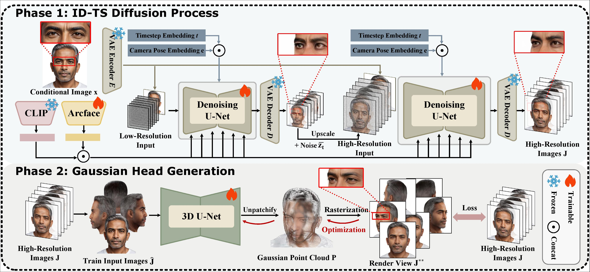

# [AAAI 2026] High-Quality Full-Head 3D Avatar Generation from Any Single Portrait Image (HQ-Head)
[](https://arxiv.org/abs/2503.08516) [](https://biggaoga.github.io/HQ-Head-Generation/) [](https://huggingface.co/datasets/CaiYuanhao/DiffusionGS)


## Environment Setup

### Requirements
- Python 3.10
- CUDA 11.8

### Installation
```bash
# Create virtual environment
conda create -n hq-head python=3.10
conda activate hq-head

# Install PyTorch
pip install torch==2.1.0 torchvision==0.16.0 --index-url https://download.pytorch.org/whl/cu118

# Install xformer
pip install -U xformers==0.0.22.post7 --index-url https://download.pytorch.org/whl/cu118

# Install CLIP
pip install git+https://github.com/openai/CLIP.git

# Install other dependencies
pip install requirements.txt

# Install Gaussian
git clone --recursive https://github.com/ashawkey/diff-gaussian-rasterization
pip install ./diff-gaussian-rasterization
```

## Download Checkpoints

Download the pretrained model checkpoints from [Hugging Face](https://huggingface.co/BarryGao/HQ-Head) and place them in the `ckpts/` directory:

```bash
mkdir -p ckpts
# Download checkpoints from https://huggingface.co/BarryGao/HQ-Head
```

## Usage

### Quick Start
```bash
python pipeline_infer_full.py --input_path examples/your_image.jpg --output_dir results
```

### Arguments

| Argument | Default | Description |
|----------|---------|-------------|
| `--input_path` | `examples` | Input image path or directory |
| `--output_dir` | `results` | Output directory |
| `--seed` | `None` | Random seed |
| `--low_config` | `configs/multiview/inference_low.yaml` | Low-resolution MV config |
| `--low_ckpt` | `ckpts/low_stage.pt` | Low-resolution MV checkpoint |
| `--high_config` | `configs/multiview/inference-high.yaml` | High-resolution MV config |
| `--high_ckpt` | `ckpts/high_stage.pt` | High-resolution MV checkpoint |
| `--elevation` | `0` | Elevation angle for multi-view generation |
| `--recon_config` | `configs/recon/inference.yaml` | Reconstruction config |
| `--recon_resume` | `ckpts/recon.safetensors` | LGM checkpoint path |
| `--lr` | `1e-6` | Learning rate for reconstruction fine-tuning |
| `--num_epochs` | `500` | Number of epochs for reconstruction fine-tuning |

### Stage-wise Pipeline

The pipeline consists of three stages. You can also run them separately:

#### Stage 1: Low-Resolution Multi-View Generation
```bash
python pipeline_infer_low.py --image_path examples/your_image.jpg --output_dir results
```

| Argument | Default | Description |
|----------|---------|-------------|
| `--denoise_config` | `configs/multiview/inference_low.yaml` | Model config |
| `--denoise_checkpoint` | - | Model checkpoint path |
| `--image_path` | `examples` | Input image path |
| `--output_dir` | `results` | Output directory |
| `--elevation` | `0` | Elevation angle |

#### Stage 2: High-Resolution Multi-View Generation
```bash
python pipeline_infer_high.py --image_path results/1 --elevation 0
```

| Argument | Default | Description |
|----------|---------|-------------|
| `--denoise_config` | `configs/multiview/inference-high.yaml` | Model config |
| `--denoise_checkpoint` | - | Model checkpoint path |
| `--image_path` | `results` | Input image path (from Stage 1) |
| `--elevation` | `0` | Elevation angle |

#### Stage 3: 3D Reconstruction
```bash
python pipeline_recon.py --image_path results/1 --num_epochs 100
```

| Argument | Default | Description |
|----------|---------|-------------|
| `--recon_config` | `configs/recon/inference.yaml` | Reconstruction config |
| `--resume` | `ckpts/recon.safetensors` | LGM checkpoint path |
| `--image_path` | `results/1` | Input multi-view images path |
| `--lr` | `1e-6` | Learning rate |
| `--num_epochs` | `100` | Number of epochs |

#### Multi-View Generation Only (Stage 1 + Stage 2)
```bash
python pipeline_infer_mv.py --input_path examples/your_image.jpg --output_dir results
```

## Citation

If you find this work useful, please cite:

```bibtex
@inproceedings{hqhead,
  title     = {High-Quality 3D Head Reconstruction from Any Single Portrait Image},
  author    = {Zhang, Jianfu and Gao, Yujie and Zhan, Jiahui and Wang, Wentao and Zhang, Yiyi and Zhao, Haohua and Zhang, Liqing},
  booktitle = {Proceedings of the AAAI Conference on Artificial Intelligence (AAAI), 2026},
  year      = {2026},
  url       = {https://arxiv.org/abs/2503.08516}
}
```

## Acknowledgement

We thank the authors of [Stable Video Diffusion (SVD)](https://StabilityAI) and [LGM](https://github.com/3DTopia/LGM) for their excellent open-source work, which greatly inspired this project.